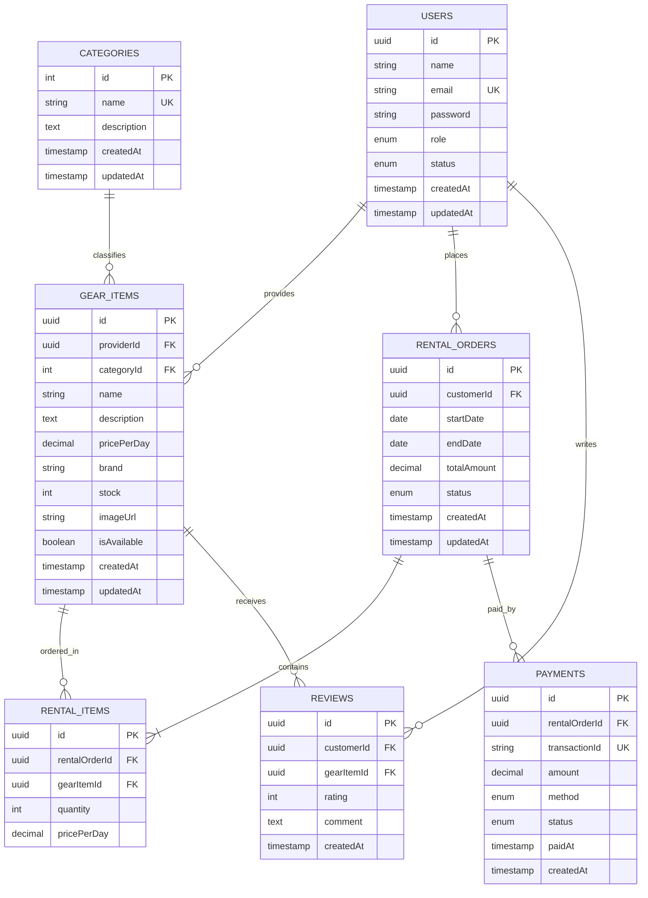

# GearUp ERD & Database Design

Here is the database entity-relationship design for the **GearUp** sports and outdoor rental platform.

---

## 📊 Entity Relationship Diagram (Mermaid)

---

## 🎨 Generated ERD Concept Image

The generated concept image is saved as `gearup_erd.png` in this directory.

---

## 📝 Schema Details

Please refer to the [erd_details.txt](./erd_details.txt) file in this folder for the full database schema definitions, data types, and relationship descriptions.
